# High-Throughput UAV Phenotyping for Soybean Resistance to Stink Bug
Complex in Brazil
João Paulo Silva Pavan
2026-03-14

# [2026 Soybean Symposium](https://soybeancenter.missouri.edu/symposium/)

- **When**: March 4th, 2026

- **Where:** University of Missouri, Columbia, MO, Memorial Union North
  201ABC

- **What:** The symposium will bring together researchers and
  stakeholders across the soybean value chain to network, present
  research findings, and promote interdisciplinary collaborations. It
  will feature four leading experts in the areas of soybean molecular
  genetics, weed science, food science, and soybean breeding.
  Participants also have the opportunity to volunteer poster
  presentations and discuss their work during a poster session which
  will be coupled with a reception. This free symposium is open to
  researchers, students, industry, farmers, and other stakeholders
  interested in soybean.

# <u>Poster Presentation, Competition and Reception:</u>

# High-Throughput UAV Phenotyping for Soybean Resistance to Stink Bug Complex in Brazil

João Paulo Silva Pavan¹², Maiara de Oliveira¹, Francia Ravelombola¹,
Cheryl Adeva¹, Jéssica Argenta¹, José Tiago Barroso Chagas², Maurício
dos Santos Araújo ² , Gérson do Nascimento Costa Ferreira ², Destiny
Hunt¹, José Baldin Pinheiro², Feng Lin¹

¹ University of Missouri-Fisher Delta Research, Extension and Education
Center

² “Luiz de Queiroz” College of Agriculture (ESALQ/University of São
Paulo)

# **Introduction**

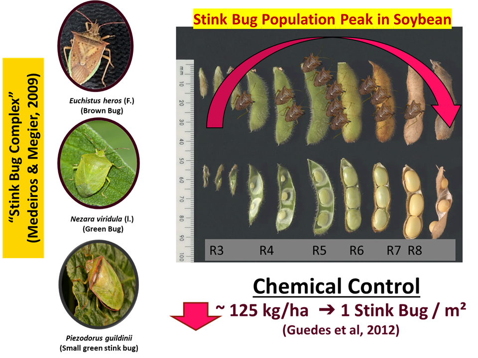

# Objective

### To identify vegetation indices (VI) derived from high-throughput phenotyping using Unmanned Aerial Vehicles (UAVs) that are correlated with soybean resistance and tolerance to the stink bug complex.

# Material and Methods

## Plant material: 30 soybean genotypes of Value for Cultivation and Use (VCU) trials

## Trials:

Season 2024/2025 (December - April)

- AC (Anhumas, Piracicaba, SP) – with insecticide control;

- AN/C (Anhumas, Piracicaba, SP) – without insecticide control;

- Jab (UNESP Jaboticabal, SP) – with insecticide control

### Experimental Design

- RCBD

- 3 Rep

- Harvested Plot Area: 4.5m x 1m

## High-throughtput Phenotyping

- ± 12h;

- DJI Mavic Air 2 Sensor RGB 1/2.0” CMOS 48-MP

- Flight Map Plan: DroneLink - 85% frontal + lateral overlap; 10m
  Altitude

- WebODM: Build Orthomosaics


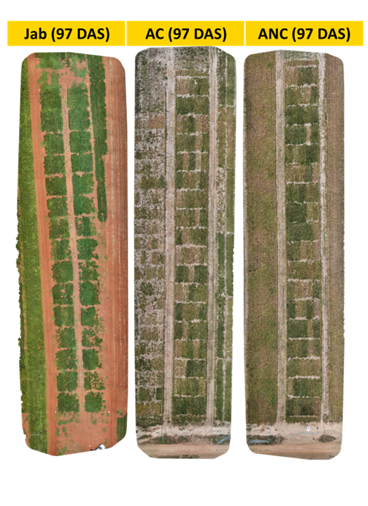

- DAS: Days after sow
- FieldImageR and FieldImageRExtra Packages: Create a grid (Shapefile),
  Segmentation (Plots) and Extract RGB VIs

## Field Traits

- Agronomic Value (AV): Scored on a 1–5 scale

- Plant Height at Maturity (PHM - cm)

- Days to Maturity (NDM)

- Grain Yield (GY – kg/ha)

- Leaf Retention (LR): Scored on a 1–5 scale

- Weight of Healthy Seeds (WHS - kg/ha)

- Tolerance (TOL) = (1−(𝐺𝑌−WHS/𝐺𝑌)) ×100

## Statistical analyses

Metan Package:

1.  Mixed Models

2.  LRT

3.  Significant traits

4.  Genotypic values (BLUEs)

5.  Pearson’s correlation → PCA

6.  Linear Regression

# Results

**Importing the dataset**

``` r
library(openxlsx)
nocontrol2425 = read.xlsx("C://Users//joaop//Documents//GitHub//DGM-CFAI//shp2425//VCP_NControl2.xlsx")
control2425 = read.xlsx("C://Users//joaop//Documents//GitHub//DGM-CFAI//shp2425//VCP_Control2.xlsx")
jab2425 = read.xlsx("C://Users//joaop//Documents//GitHub//DGM-CFAI//shp2425//Jab2425VCU.xlsx")
str(nocontrol2425)
str(control2425)
str(jab2425)
```

**Loading the Packages**

``` r
library(FIELDimageR)
library(FIELDimageR.Extra)
library(EBImage)
library(stars)
library(pliman)
library(leafsync)
library(mapedit)
library(mapview)
library(terra)
library(sf)
library(raster)
library(EBImage)
library(dplyr)
library(tidyr)
library(reshape2)
library(ggplot2)
library(metan)
library(ggspatial)
library(ggplot2)
library(correlation)
library(corrplot)
library(factoextra)
library(FactoMineR)
library(openxlsx)
library(ggrepel)
library(ggpmisc)
```

**Creating a FieldMap**

``` r
fm_EEXP_ANH140125_27m = fieldMap(fieldPlot=control2425$Plot, fieldColumn=control2425$Column, fieldRow=control2425$Row, decreasing=F)
fm_nocontrol2425 = fieldMap(fieldPlot=nocontrol2425$Plot, fieldColumn=nocontrol2425$Column, fieldRow=nocontrol2425$Row, decreasing=F)
fm_control2425 = fieldMap(fieldPlot=control2425$Plot, fieldColumn=control2425$Column, fieldRow=control2425$Row, decreasing=F)
fm_jab2425 = fieldMap(fieldPlot=jab2425$Plot, fieldColumn=jab2425$Column, fieldRow=jab2425$Row, decreasing=F)
fm_nocontrol2425
```

**Importing the Orthomosaic**

``` r
EEXP_ANH140125_27m= rast("C://Users//joaop//Documents//GitHub//MU2026//ortho//EEXP_ANHUMAS_SOY_14_01_24_27m_modificado.tif")
rastnocontrol2425 = rast("C://Users//joaop//Documents//GitHub//MU2026//ortho//250318_VCU_NOCONTROL_10m_drought_c.tif")
rastcontrol2425 = rast("C://Users//joaop//Documents//GitHub//MU2026//ortho//250318_VCU_CONTROL_10m_drought_c.tif")
rastjab2425 = rast("C://Users//joaop//Documents//GitHub//MU2026//ortho/250225_VCPJAB_10m.tif")
```

**Building an ANC (Anhumas, Piracicaba, SP) – without insecticide
control Shapefile**

``` r
nocontrol2425shp <-fieldShape_render(mosaic = EEXP_ANH140125_27m,
                             ncols=5,
                             nrows=18,
                             fieldData = nocontrol2425,
                             fieldMap = fm_nocontrol2425,
                             PlotID = "Plot",
                             plot_size = c(1, 4.3))
```

**View Shapefile**

``` r
fieldView(mosaic = rastnocontrol2425,
          fieldShape = nocontrol2425shp,
          type = 2,
          alpha = 0.2)   
```

**Save Shapefile**

``` r
st_write(nocontrol2425shp, "nocontrol2425shp_plot2.shp")
```

**Building an AC (Anhumas, Piracicaba, SP) – insecticide control
Shapefile**

``` r
control2425shp <-fieldShape_render(mosaic = EEXP_ANH140125_27m,
                             ncols=5,
                             nrows=18,
                             fieldData = control2425,
                             fieldMap = fm_control2425,
                             PlotID = "Plot",
                             plot_size = c(1, 4.3))
```

**View Shapefile**

``` r
fieldView(mosaic = rastcontrol2425,
          fieldShape = control2425shp,
          type = 2,
          alpha = 0.2)   
```

**Save Shapefile**

``` r
st_write(control2425shp, "control2425shp_plot.shp")
```

**Building a Jab (UNESP Jaboticabal, SP - insecticide control
Shapefile**

``` r
jab2425shp <-fieldShape_render(mosaic = rastjab2425,
                             ncols=6,
                             nrows=15,
                             fieldData = jab2425,
                             fieldMap = fm_jab2425,
                             PlotID = "Plot",
                             plot_size = c(1, 4.3))
```

**View Shapefile**

``` r
fieldView(mosaic = rastjab2425,
          fieldShape = jab2425shp,
          type = 2,
          alpha = 0.2)   
```

**Save Shapefile**

``` r
st_write(jab2425shp, "jab2425shp.shp")
```

**Adjust the Shapefile in QGIS and Re-import**

``` r
nocontrol2425shp = st_read("C://Users//joaop//Documents//GitHub//MU2026//MU2026//nocontrol2425shpplot.shp")
control2425shp = st_read("C://Users//joaop//Documents//GitHub//MU2026//MU2026//control2425shp_plot.shp")
jab2425shp  = st_read("C://Users//joaop//Documents//GitHub//MU2026//MU2026//jab2425shp.shp")
```

**Segmentation of plants and soil using a Vegetation Index (VI) - ANC
(Anhumas, Piracicaba, SP) – without insecticide control**

``` r
gc()
vi_nocontrol2425= fieldIndex(mosaic = rastnocontrol2425, Red = 1, Green = 2, Blue = 3,
                             index = c("BI", "NGRDI","BGI", "GLI", "VARI", "HUE", "HI", "SCI", "SI"))
for(i in 5:nlyr(vi_nocontrol2425)){
  plot(vi_nocontrol2425[[i]],
       main = names(vi_nocontrol2425)[i],
       col = hcl.colors(100, "RdYlGn"))
}
gc()
```

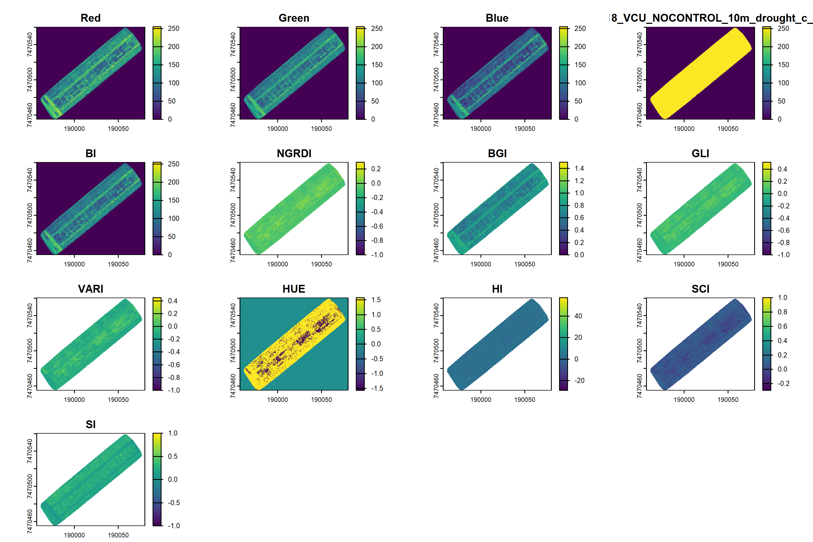

``` r
gc()
vi2_nocontrol2425= fieldIndex(mosaic = rastnocontrol2425, Red = 1, Green = 2, Blue = 3,
                             myIndex = c("((Red - Blue) / Red)", # 1 CI  - Coloration Index
                                         "(0.811*Green)+(0.385*Blue)+18.78745", # 2 CIVE    Color Index of Vegetation Extraction
                                         "2 * Green - Red - Blue", #3 EGVI -    Excess Green Index
                                         "(Green - Blue)/(Green + Red - Blue)", #4 MVARI - Modified Visible Atmospherically Resistant Vegetation Index
                                         "(Green-Blue)/(Green+Blue)", # 5 NGBDI - Normalized Green-Blue Difference Index
                                         "(1 + 0.5)*(Green-Red)/(Green+Red+0.5)", # 6 SAVI - Soil Adjusted Vegetation Index
                                         "Green - 0.39*Red - 0.61*Blue", # 7 TGI    Triangular Greenness Index
                                         "Green/(Red^0.667 * Blue^0.334)", # 8 VEG - Vegetative Index
                                         "(Green - Blue)/(Red - Green)")) # 9 WI    - Woebbecke Index
names(vi2_nocontrol2425)[6:14] <- c(
  "CI",
  "CIVE",
  "EGVI",
  "MVARI",
  "NGBDI",
  "SAVI",
  "TGI",
  "VEG",
  "WI"
)

for(i in 6:nlyr(vi2_nocontrol2425)){
  plot(vi2_nocontrol2425[[i]],
       main = names(vi2_nocontrol2425)[i],
       col = hcl.colors(100, "RdYlGn"))
}
gc()
```

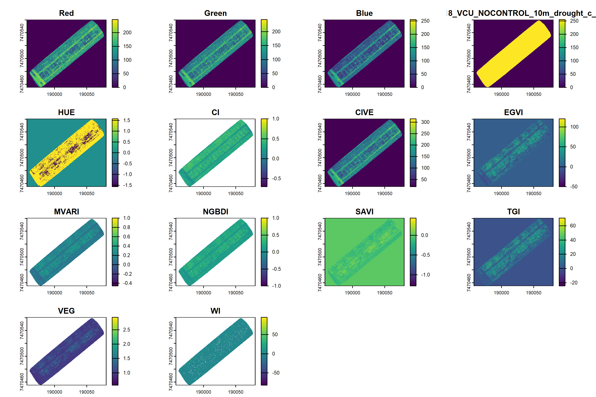

**Segmentation of plants and soil using a Vegetation Index (VI) - AC
(Anhumas, Piracicaba, SP) – insecticide control**

``` r
gc()
vi_control2425= fieldIndex(mosaic = rastcontrol2425, Red = 1, Green = 2, Blue = 3,
                             index = c("BI", "NGRDI","BGI", "GLI", "VARI", "HUE", "HI", "SCI", "SI"))
for(i in 5:nlyr(vi_control2425)){
  plot(vi_control2425[[i]],
       main = names(vi_control2425)[i],
       col = hcl.colors(100, "RdYlGn"))
}
gc()
```

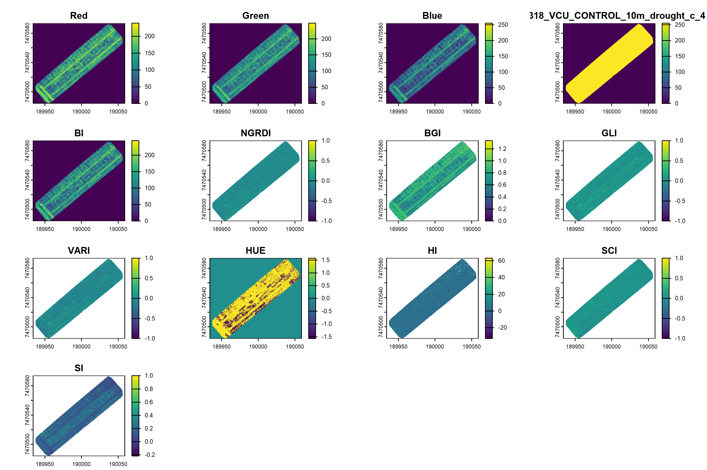

``` r
gc()
vi2_control2425= fieldIndex(mosaic = rastcontrol2425, Red = 1, Green = 2, Blue = 3,
                             myIndex = c("((Red - Blue) / Red)", # 1 CI  - Coloration Index
                                         "(0.811*Green)+(0.385*Blue)+18.78745", # 2 CIVE    Color Index of Vegetation Extraction
                                         "2 * Green - Red - Blue", #3 EGVI -    Excess Green Index
                                         "(Green - Blue)/(Green + Red - Blue)", #4 MVARI - Modified Visible Atmospherically Resistant Vegetation Index
                                         "(Green-Blue)/(Green+Blue)", # 5 NGBDI - Normalized Green-Blue Difference Index
                                         "(1 + 0.5)*(Green-Red)/(Green+Red+0.5)", # 6 SAVI - Soil Adjusted Vegetation Index
                                         "Green - 0.39*Red - 0.61*Blue", # 7 TGI    Triangular Greenness Index
                                         "Green/(Red^0.667 * Blue^0.334)", # 8 VEG - Vegetative Index
                                         "(Green - Blue)/(Red - Green)")) # 9 WI    - Woebbecke Index
names(vi2_control2425)[6:14] <- c(
  "CI",
  "CIVE",
  "EGVI",
  "MVARI",
  "NGBDI",
  "SAVI",
  "TGI",
  "VEG",
  "WI"
)

for(i in 6:nlyr(vi2_control2425)){
  plot(vi2_control2425[[i]],
       main = names(vi2_control2425)[i],
       col = hcl.colors(100, "RdYlGn"))
}
gc()
```


**Segmentation of plants and soil using a Vegetation Index (VI) - Jab
(UNESP Jaboticabal, SP) – with insecticide control**

``` r
gc()
vi_jab2425= fieldIndex(mosaic = rastjab2425, Red = 1, Green = 2, Blue = 3,
                             index = c("BI", "NGRDI","BGI", "GLI", "VARI", "HUE", "HI", "SCI", "SI"))

for(i in 5:nlyr(vi_jab2425)){
  plot(vi_jab2425[[i]],
       main = names(vi_jab2425)[i],
       col = hcl.colors(100, "RdYlGn"))
}
gc()
```

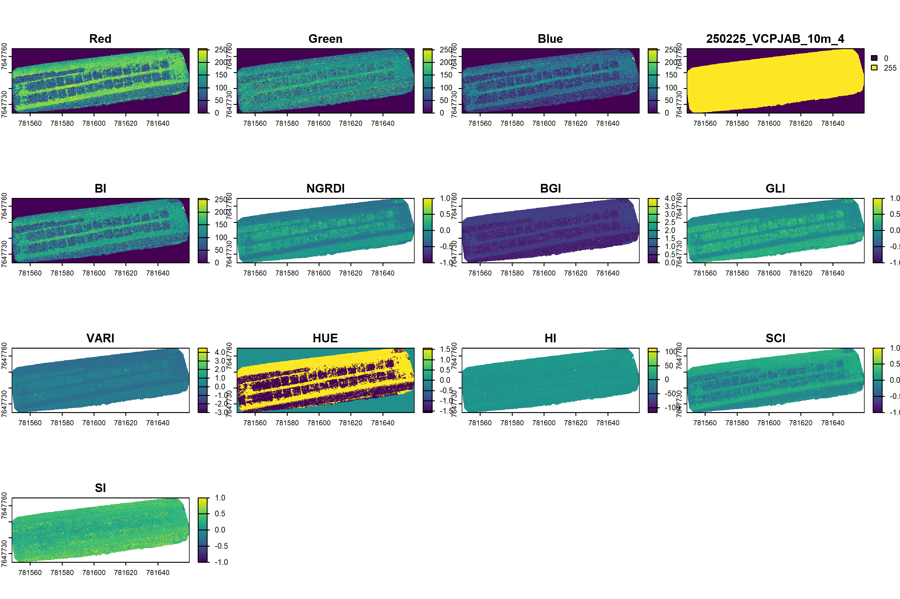

``` r
gc()
vi2_jab2425= fieldIndex(mosaic = rastjab2425, Red = 1, Green = 2, Blue = 3,
                             myIndex = c("((Red - Blue) / Red)", # 1 CI  - Coloration Index
                                         "(0.811*Green)+(0.385*Blue)+18.78745", # 2 CIVE    Color Index of Vegetation Extraction
                                         "2 * Green - Red - Blue", #3 EGVI -    Excess Green Index
                                         "(Green - Blue)/(Green + Red - Blue)", #4 MVARI - Modified Visible Atmospherically Resistant Vegetation Index
                                         "(Green-Blue)/(Green+Blue)", # 5 NGBDI - Normalized Green-Blue Difference Index
                                         "(1 + 0.5)*(Green-Red)/(Green+Red+0.5)", # 6 SAVI - Soil Adjusted Vegetation Index
                                         "Green - 0.39*Red - 0.61*Blue", # 7 TGI    Triangular Greenness Index
                                         "Green/(Red^0.667 * Blue^0.334)", # 8 VEG - Vegetative Index
                                         "(Green - Blue)/(Red - Green)")) # 9 WI    - Woebbecke Index
names(vi2_jab2425)[6:14] <- c(
  "CI",
  "CIVE",
  "EGVI",
  "MVARI",
  "NGBDI",
  "SAVI",
  "TGI",
  "VEG",
  "WI"
)

for(i in 6:nlyr(vi2_jab2425)){
  plot(vi2_jab2425[[i]],
       main = names(vi2_jab2425)[i],
       col = hcl.colors(100, "RdYlGn"))
}
gc()
```

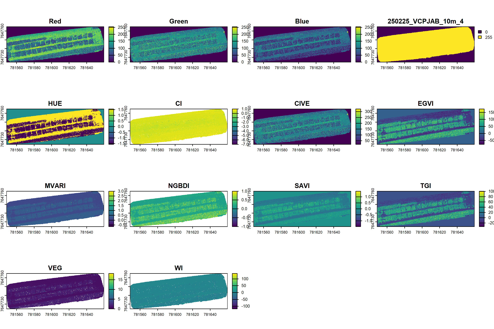

**Threshold of the best VI selected in the previous step**

``` r
(function(v) {h <- hist(v, breaks=128, plot=FALSE); p <- h$counts/sum(h$counts); w <- cumsum(p); m <- cumsum(p*h$mids); mt <- m[length(m)]; sb <- (mt*w - m)^2/(w*(1-w)); sb[is.na(sb)] <- 0; h$mids[which.max(sb)]})(values(vi_nocontrol2425$SI, na.rm=TRUE))
(function(v) {h <- hist(v, breaks=128, plot=FALSE); p <- h$counts/sum(h$counts); w <- cumsum(p); m <- cumsum(p*h$mids); mt <- m[length(m)]; sb <- (mt*w - m)^2/(w*(1-w)); sb[is.na(sb)] <- 0; h$mids[which.max(sb)]})(values(vi_control2425$SI, na.rm=TRUE))
(function(v) {h <- hist(v, breaks=128, plot=FALSE); p <- h$counts/sum(h$counts); w <- cumsum(p); m <- cumsum(p*h$mids); mt <- m[length(m)]; sb <- (mt*w - m)^2/(w*(1-w)); sb[is.na(sb)] <- 0; h$mids[which.max(sb)]})(values(vi_jab2425$GLI, na.rm=TRUE))
```

**Apply the threshold value obtained in the previous step to the
functions below:**

``` r
gc()
nocontrol2425SI = fieldMask(mosaic = rastnocontrol2425, Red = 1, Green = 2, Blue = 3,
                           index = "SI", cropValue = 0.23, cropAbove = F)
control2425SI = fieldMask(mosaic = rastcontrol2425, Red = 1, Green = 2, Blue = 3,
                           index = "SI", cropValue = 0.19, cropAbove = F)
jab2425GLI = fieldMask(mosaic = rastjab2425, Red = 1, Green = 2, Blue = 3,
                            index = "GLI", cropValue = 0.09, cropAbove = F)
gc()
```

nocontrol2425SI

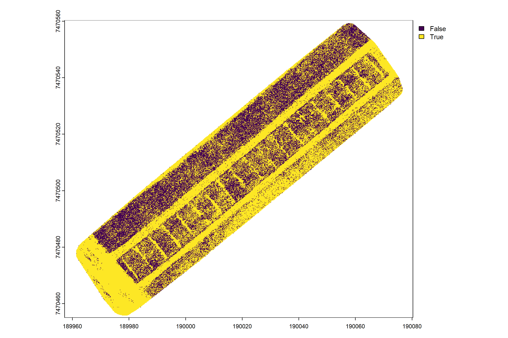

control2425SI

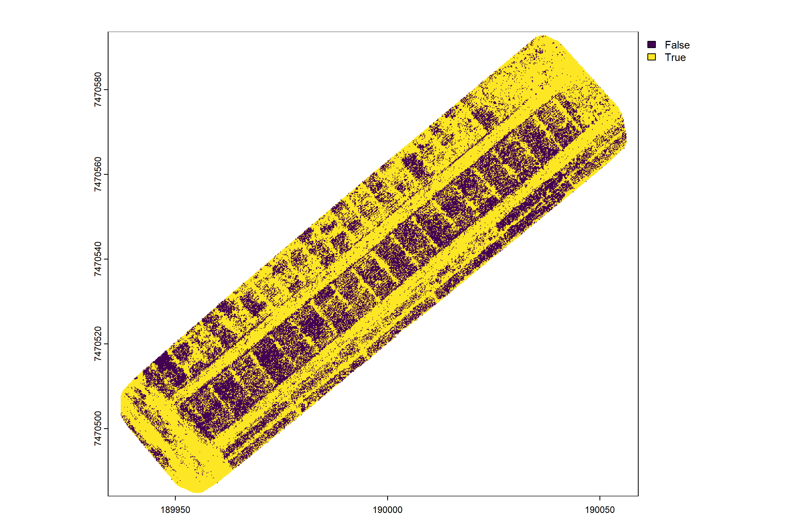

jab2425GLI

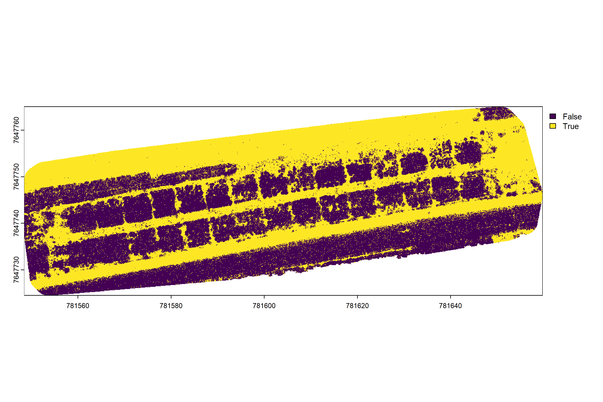

**RGB VIs**

``` r
vegindex = c("BI", "NGRDI","BGI", "GLI", "VARI", "HUE", "HI", "SCI", "SI")
vegindex2 = c("((Red - Blue) / Red)", # 1 CI     - Coloration Index
                                         "(0.811*Green)+(0.385*Blue)+18.78745", # 2 CIVE    Color Index of Vegetation Extraction
                                         "2 * Green - Red - Blue", #3 EGVI -    Excess Green Index
                                         "(Green - Blue)/(Green + Red - Blue)", #4 MVARI - Modified Visible Atmospherically Resistant Vegetation Index
                                         "(Green-Blue)/(Green+Blue)", # 5 NGBDI - Normalized Green-Blue Difference Index
                                         "(1 + 0.5)*(Green-Red)/(Green+Red+0.5)", # 6 SAVI - Soil Adjusted Vegetation Index
                                         "Green - 0.39*Red - 0.61*Blue", # 7 TGI    Triangular Greenness Index
                                         "Green/(Red^0.667 * Blue^0.334)", # 8 VEG - Vegetative Index
                                         "(Green - Blue)/(Red - Green)") # 9 WI - Woebbecke Index
```

**Extraction of plots VIs - ANC (Anhumas, Piracicaba, SP) – without
insecticide control**

``` r
gc()
vi1nocontrol2425= fieldIndex(mosaic = nocontrol2425SI$newMosaic, Red = 1, Green = 2, Blue = 3,index = vegindex)
gc()
vi2nocontrol2425= fieldIndex(mosaic = nocontrol2425SI$newMosaic, Red = 1, Green = 2, Blue = 3,myIndex = vegindex2)
gc()
```

**Extraction of plots VIs - AC (Anhumas, Piracicaba, SP) – with
insecticide control**

``` r
gc()
vi1control2425= fieldIndex(mosaic = control2425SI$newMosaic, Red = 1, Green = 2, Blue = 3,index = vegindex)
gc()
vi2control2425= fieldIndex(mosaic = control2425SI$newMosaic, Red = 1, Green = 2, Blue = 3,myIndex = vegindex2)
gc()
```

**Extraction of plots VIs - Jab (UNESP Jaboticabal, SP) – with
insecticide control**

``` r
gc()
vi1jab2425= fieldIndex(mosaic = jab2425GLI$newMosaic, Red = 1, Green = 2, Blue = 3,index = vegindex)
gc()
vi2jab2425= fieldIndex(mosaic = jab2425GLI$newMosaic, Red = 1, Green = 2, Blue = 3,myIndex = vegindex2)
gc()
```

**VIs - ANC (Anhumas, Piracicaba, SP) – without insecticide control**

Mean, Standard Deviation (SD), 25% quantile (Q25), 50% quantile (Q50),
75% quantile (Q75)

``` r
gc()
nocontrol2425_2 = terra::extract(
  vi1nocontrol2425,
  vect(nocontrol2425shp),
  fun = function(x) {
    c(Mean = mean(x, na.rm = TRUE),
      SD = sd(x, na.rm = TRUE),
      Q25 = quantile(x, 0.25, na.rm = TRUE),
      Q50 = quantile(x, 0.50, na.rm = TRUE),
      Q75 = quantile(x, 0.75, na.rm = TRUE)
    )
  }
)
for(i in vegindex){
  colnames(nocontrol2425_2)[grep(paste0("^",i,"(\\.|$)"), colnames(nocontrol2425_2))] <- c(
    paste0(i, "_Mean"),
    paste0(i, "_SD"),
    paste0(i, "_Q25"),
    paste0(i, "_Q50"),
    paste0(i, "_Q75")
  )
}
nocontrol2425_3 = terra::extract(
  vi2nocontrol2425,
  vect(nocontrol2425shp),
  fun = function(x) {
    c(Mean = mean(x, na.rm = TRUE),
      SD = sd(x, na.rm = TRUE),
      Q25 = quantile(x, 0.25, na.rm = TRUE),
      Q50 = quantile(x, 0.50, na.rm = TRUE),
      Q75 = quantile(x, 0.75, na.rm = TRUE)
    )
  }
)
vegindex2names <- c("CI", "CIVE", "EGVI", "MVARI", "NGBDI", "SAVI", "TGI", "VEG", "WI")
myindex_cols <- grep("^myIndex", colnames(nocontrol2425_3))
if(length(myindex_cols) != length(vegindex2names)*5){
  stop("stop")
}
for(i in seq_along(vegindex2names)){
  cols_block <- myindex_cols[((i-1)*5 + 1):(i*5)]
  colnames(nocontrol2425_3)[cols_block] <- paste0(vegindex2names[i], c("_Mean","_SD","_Q25","_Q50","_Q75"))}
```

**Join the extracted data to the plot shapefile**

``` r
library(sf)
library(dplyr)
ncdf2 <- as.data.frame(nocontrol2425_2)
ncdf3 <- as.data.frame(nocontrol2425_3)
colnames(ncdf2)[1] <- "ID"
colnames(ncdf3)[1] <- "ID"
ncdfcomb <- left_join(ncdf2, ncdf3, by = "ID", suffix = c("_raw","_stats"))
shpnocontrol2425 <- left_join(nocontrol2425shp, ncdfcomb, 
                                by = c("unique_id" = "ID"))
```

**VIs - AC (Anhumas, Piracicaba, SP) – with insecticide control**

Mean, Standard Deviation (SD), 25% quantile (Q25), 50% quantile (Q50),
75% quantile (Q75)

``` r
gc()
control2425_2 = terra::extract(
  vi1control2425,
  vect(control2425shp),
  fun = function(x) {
    c(Mean = mean(x, na.rm = TRUE),
      SD = sd(x, na.rm = TRUE),
      Q25 = quantile(x, 0.25, na.rm = TRUE),
      Q50 = quantile(x, 0.50, na.rm = TRUE),
      Q75 = quantile(x, 0.75, na.rm = TRUE)
    )
  }
)
for(i in vegindex){
  colnames(control2425_2)[grep(paste0("^",i,"(\\.|$)"), colnames(control2425_2))] <- c(
    paste0(i, "_Mean"),
    paste0(i, "_SD"),
    paste0(i, "_Q25"),
    paste0(i, "_Q50"),
    paste0(i, "_Q75")
  )
}
control2425_3 = terra::extract(
  vi2control2425,
  vect(control2425shp),
  fun = function(x) {
    c(Mean = mean(x, na.rm = TRUE),
      SD = sd(x, na.rm = TRUE),
      Q25 = quantile(x, 0.25, na.rm = TRUE),
      Q50 = quantile(x, 0.50, na.rm = TRUE),
      Q75 = quantile(x, 0.75, na.rm = TRUE)
    )
  }
)
vegindex2names <- c("CI", "CIVE", "EGVI", "MVARI", "NGBDI", "SAVI", "TGI", "VEG", "WI")
myindex_cols <- grep("^myIndex", colnames(control2425_3))
if(length(myindex_cols) != length(vegindex2names)*5){
  stop("stop")
}
for(i in seq_along(vegindex2names)){
  cols_block <- myindex_cols[((i-1)*5 + 1):(i*5)]
  colnames(control2425_3)[cols_block] <- paste0(vegindex2names[i], c("_Mean","_SD","_Q25","_Q50","_Q75"))}
```

**Join the extracted data to the plot shapefile**

``` r
cdf2 <- as.data.frame(control2425_2)
cdf3 <- as.data.frame(control2425_3)
colnames(cdf2)[1] <- "ID"
colnames(cdf3)[1] <- "ID"
cdfcomb <- left_join(cdf2, cdf3, by = "ID", suffix = c("_raw","_stats"))
shpcontrol2425 <- left_join(control2425shp, cdfcomb, 
                                by = c("unique_id" = "ID"))
```

**VIs - Jab (UNESP Jaboticabal, SP) – with insecticide control**

Mean, Standard Deviation (SD), 25% quantile (Q25), 50% quantile (Q50),
75% quantile (Q75)

``` r
gc()
jab2425_2 = terra::extract(
  vi1jab2425,
  vect(jab2425shp),
  fun = function(x) {
    c(Mean = mean(x, na.rm = TRUE),
      SD = sd(x, na.rm = TRUE),
      Q25 = quantile(x, 0.25, na.rm = TRUE),
      Q50 = quantile(x, 0.50, na.rm = TRUE),
      Q75 = quantile(x, 0.75, na.rm = TRUE)
    )
  }
)
for(i in vegindex){
  colnames(jab2425_2)[grep(paste0("^",i,"(\\.|$)"), colnames(jab2425_2))] <- c(
    paste0(i, "_Mean"),
    paste0(i, "_SD"),
    paste0(i, "_Q25"),
    paste0(i, "_Q50"),
    paste0(i, "_Q75")
  )
}
jab2425_3 = terra::extract(
  vi2jab2425,
  vect(jab2425shp),
  fun = function(x) {
    c(Mean = mean(x, na.rm = TRUE),
      SD = sd(x, na.rm = TRUE),
      Q25 = quantile(x, 0.25, na.rm = TRUE),
      Q50 = quantile(x, 0.50, na.rm = TRUE),
      Q75 = quantile(x, 0.75, na.rm = TRUE)
    )
  }
)
vegindex2names <- c("CI", "CIVE", "EGVI", "MVARI", "NGBDI", "SAVI", "TGI", "VEG", "WI")
myindex_cols <- grep("^myIndex", colnames(jab2425_3))
if(length(myindex_cols) != length(vegindex2names)*5){
  stop("stop")
}
for(i in seq_along(vegindex2names)){
  cols_block <- myindex_cols[((i-1)*5 + 1):(i*5)]
  colnames(jab2425_3)[cols_block] <- paste0(vegindex2names[i], c("_Mean","_SD","_Q25","_Q50","_Q75"))}
```

**Join the extracted data to the plot shapefile**

``` r
jabdf2 <- as.data.frame(jab2425_2)
jabdf3 <- as.data.frame(jab2425_3)
colnames(jabdf2)[1] <- "ID"
colnames(jabdf3)[1] <- "ID"
jabdfcomb <- left_join(jabdf2, jabdf3, by = "ID", suffix = c("_raw","_stats"))
shpjab2425 <- left_join(jab2425shp, jabdfcomb, 
                                by = c("unique_id" = "ID"))
```

**Save the Shapefiles**

``` r
sf::st_write(shpnocontrol2425, "shpnocontrol2425.shp")
sf::st_write(shpnocontrol2425, "shpcontrol2425.shp")
sf::st_write(shpnocontrol2425, "shpjab2425.shp")
```

**Convert the shapefile into a tibble**

``` r
library(writexl)

control2425_tb    <- shpcontrol2425   |> st_drop_geometry() |> as_tibble()
nocontrol2425_tb  <- shpnocontrol2425 |> st_drop_geometry() |> as_tibble()
jab2425_tb        <- shpjab2425       |> st_drop_geometry() |> as_tibble()
```

**Save the Tibble**

``` r
write_xlsx(control2425_tb,   "control_2425.xlsx")
write_xlsx(nocontrol2425_tb, "nocontrol_2425.xlsx")
write_xlsx(jab2425_tb,       "jab_2425.xlsx")
```

**If you extracted the indices using a different method and want to
incorporate them into the Shapefile…**

``` r
#Open the table with the Vegetation Index 
nocontrol2425 = read.xlsx("C://Users//joaop//Documents//GitHub//MU2026//MU2026//nocontrol_2425.xlsx")
control2425 = read.xlsx("C://Users//joaop//Documents//GitHub//MU2026//MU2026//control_2425.xlsx")
jab2425 = read.xlsx("C://Users//joaop//Documents//GitHub//MU2026//MU2026//jab_2425.xlsx")
#Join it with Shapefile
shpnocontrol2425 <- dplyr::left_join(
  nocontrol2425shp,
  nocontrol2425,
  by = c("Row", "Column", "Plot")
)
shpcontrol2425 <- dplyr::left_join(
  control2425shp,
  control2425,
  by = c("Row", "Column", "Plot")
)
shpjab24255 <- dplyr::left_join(
  jab2425shp,
  jab2425,
  by = c("Row", "Column", "Plot")
)
```

**Visualization of the orthomosaic and plot shapefile**

``` r
gc()
nocontrol2425SI_view = fieldView(mosaic = nocontrol2425SI$newMosaic,
          fieldShape = shpnocontrol2425, 
          plotCol = "TOL.x",
          col_grid = c("#F2D400","#FFA500", "#90EE90"),
          type = 2,
          alpha_grid = 0.6)
```

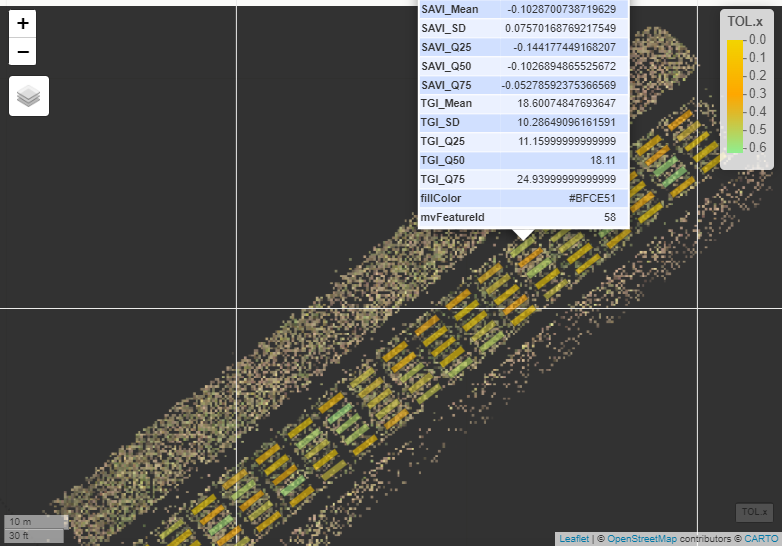

``` r
gc()
fieldView(mosaic = control2425SI$newMosaic,
          fieldShape = shpcontrol2425, 
          plotCol = "TOL.x",
          col_grid = c("#F2D400","#FFA500", "#90EE90"),
          type = 2,
          alpha_grid = 0.6)
```

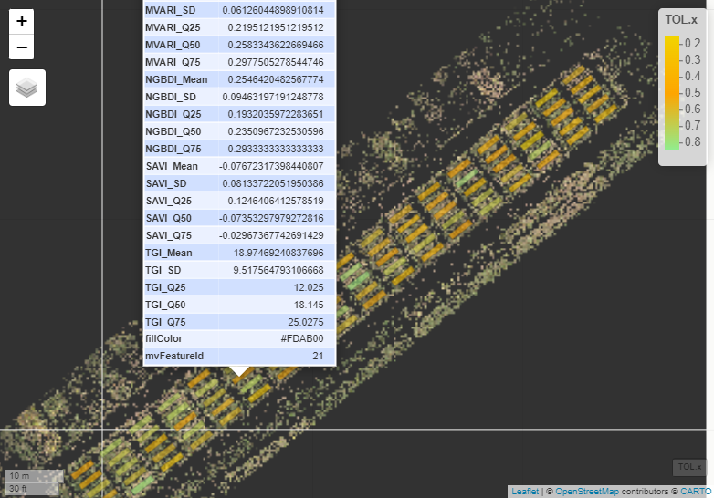

``` r
gc()
fieldView(mosaic = jab2425GLI$newMosaic,
          fieldShape = shpjab24255, 
          plotCol = "TOL.x",
          col_grid = c("#F2D400","#FFA500", "#90EE90"),
          type = 2,
          alpha_grid = 0.6)
```

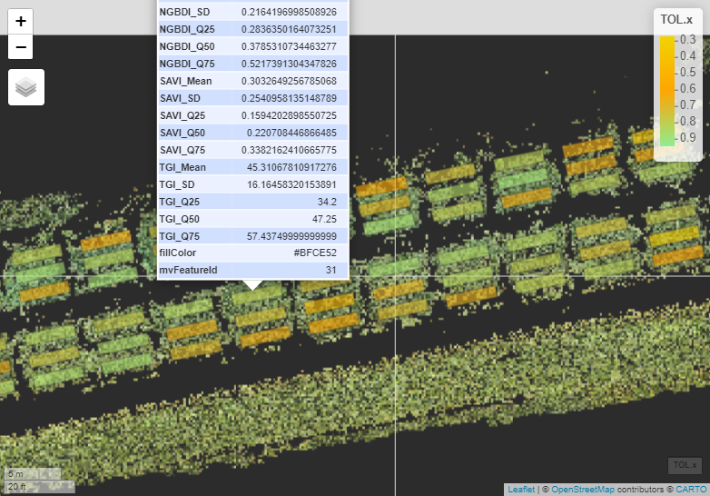

**Importing the joint dataset (ANC + AC + Jab)**

``` r
mu26 = read.xlsx("C://Users//joaop//Documents//GitHub//MU2026//MU2026//mu26.xlsx")
mu26$Row      <- as.factor(mu26$Row)
mu26$Column   <- as.factor(mu26$Column)
mu26$Block    <- as.factor(mu26$Block)
mu26$Plot   <- as.factor(mu26$Plot)
mu26$Genotype <- as.factor(mu26$Genotype)
mu26$Env    <- as.factor(mu26$Env)
str(mu26)
```

    'data.frame':   270 obs. of  97 variables:
     $ Env       : Factor w/ 3 levels "AC","ANC","Jab": 1 1 1 1 1 1 1 1 1 1 ...
     $ unique_id : num  1 12 23 34 45 56 67 78 89 2 ...
     $ Row       : Factor w/ 18 levels "1","2","3","4",..: 1 1 1 1 1 2 2 2 2 2 ...
     $ Column    : Factor w/ 6 levels "1","2","3","4",..: 1 2 3 4 5 5 4 3 2 1 ...
     $ Plot      : Factor w/ 90 levels "1","2","3","4",..: 1 2 3 4 5 6 7 8 9 10 ...
     $ Block     : Factor w/ 3 levels "1","2","3": 1 1 1 1 1 1 1 1 1 1 ...
     $ Genotype  : Factor w/ 30 levels "AS3730","BRS284",..: 9 29 6 7 8 10 24 25 28 4 ...
     $ Gen       : chr  "G09" "G29" "G06" "G07" ...
     $ NDF       : num  46 54 49 56 49 45 47 49 46 44 ...
     $ PHF       : num  52 59 40 68 72 38 51 44 40 30 ...
     $ PHM       : num  73 79 84 96 97 77 74 72 73 72 ...
     $ NDM       : num  119 122 110 110 121 106 113 109 106 105 ...
     $ AV        : num  3 4 5 3 3 5 4 5 3 3 ...
     $ LR        : num  3 5 3 1 4 1 1 3 1 1 ...
     $ GY        : num  1324 1993 2573 1765 1277 ...
     $ HSW       : num  606 833 1686 985 538 ...
     $ TOL       : num  0.458 0.418 0.655 0.558 0.421 ...
     $ BI_Mean   : num  63.4 55.6 71.9 70.9 64.6 ...
     $ BI_SD     : num  27.9 29.3 32.1 31.1 27.7 ...
     $ BI_Q25    : num  43.1 33.5 49.6 46.4 42.8 ...
     $ BI_Q50    : num  61.2 51.8 69.9 70.1 63.1 ...
     $ BI_Q75    : num  81.8 74 92.6 92.5 83 ...
     $ NGRDI_Mean: num  0.01477 0.086841 -0.000813 0.01939 0.018843 ...
     $ NGRDI_SD  : num  0.0695 0.1033 0.1008 0.0778 0.0525 ...
     $ NGRDI_Q25 : num  -0.0209 0.037 -0.0448 -0.0186 -0.0144 ...
     $ NGRDI_Q50 : num  0.0175 0.0795 0 0.0175 0.0196 ...
     $ NGRDI_Q75 : num  0.0513 0.125 0.0407 0.0506 0.052 ...
     $ BGI_Mean  : num  0.525 0.446 NA 0.539 0.553 ...
     $ BGI_SD    : num  0.126 0.143 NA 0.117 0.1 ...
     $ BGI_Q25   : num  0.461 0.373 0.429 0.484 0.5 ...
     $ BGI_Q50   : num  0.542 0.462 0.528 0.557 0.567 ...
     $ BGI_Q75   : num  0.612 0.54 0.602 0.615 0.62 ...
     $ GLI_Mean  : num  0.146 0.221 0.141 0.144 0.139 ...
     $ GLI_SD    : num  0.0758 0.1102 0.1063 0.0812 0.057 ...
     $ GLI_Q25   : num  0.1001 0.1596 0.0891 0.1005 0.1001 ...
     $ GLI_Q50   : num  0.14 0.203 0.134 0.136 0.135 ...
     $ GLI_Q75   : num  0.181 0.264 0.182 0.176 0.172 ...
     $ VARI_Mean : num  0.01873 0.10937 -0.00346 0.02416 0.02529 ...
     $ VARI_SD   : num  0.0874 0.1186 0.121 0.0945 0.0713 ...
     $ VARI_Q25  : num  -0.0294 0.0496 -0.0604 -0.0264 -0.0206 ...
     $ VARI_Q50  : num  0.0232 0.1079 0 0.0246 0.0281 ...
     $ VARI_Q75  : num  0.0708 0.162 0.0543 0.072 0.0721 ...
     $ HUE_Mean  : num  -0.3513 -1.133 0.0366 -0.4095 -0.4546 ...
     $ HUE_SD    : num  1.42 1 1.49 1.43 1.4 ...
     $ HUE_Q25   : num  -1.55 -1.56 -1.54 -1.55 -1.55 ...
     $ HUE_Q50   : num  -1.46 -1.55 0 -1.5 -1.49 ...
     $ HUE_Q75   : num  1.51 -1.5 1.55 1.52 1.48 ...
     $ HI_Mean   : num  0.978 0.539 NA NA 0.903 ...
     $ HI_SD     : num  0.637 0.555 NA NA 0.471 ...
     $ HI_Q25    : num  0.6 0.226 0.692 0.585 0.568 ...
     $ HI_Q50    : num  0.862 0.444 1 0.84 0.833 ...
     $ HI_Q75    : num  1.2 0.721 1.421 1.186 1.145 ...
     $ SCI_Mean  : num  -0.01477 -0.086841 0.000813 -0.01939 -0.018843 ...
     $ SCI_SD    : num  0.0695 0.1033 0.1008 0.0778 0.0525 ...
     $ SCI_Q25   : num  -0.0513 -0.125 -0.0407 -0.0506 -0.052 ...
     $ SCI_Q50   : num  -0.0175 -0.0795 0 -0.0175 -0.0196 ...
     $ SCI_Q75   : num  0.0209 -0.037 0.0448 0.0186 0.0144 ...
     $ SI_Mean   : num  0.309 0.33 0.342 0.293 0.277 ...
     $ SI_SD     : num  0.1159 0.1464 0.1325 0.1024 0.0845 ...
     $ SI_Q25    : num  0.234 0.238 0.254 0.227 0.219 ...
     $ SI_Q50    : num  0.277 0.286 0.312 0.267 0.252 ...
     $ SI_Q75    : num  0.346 0.372 0.389 0.324 0.308 ...
     $ CI_Mean   : num  0.462 0.482 0.497 0.445 0.428 ...
     $ CI_SD     : num  0.1158 0.1378 0.1271 0.1042 0.0929 ...
     $ CI_Q25    : num  0.379 0.385 0.406 0.37 0.359 ...
     $ CI_Q50    : num  0.434 0.444 0.476 0.421 0.403 ...
     $ CI_Q75    : num  0.515 0.543 0.56 0.489 0.471 ...
     $ CIVE_Mean : num  93.1 86.4 101.6 102.3 95.1 ...
     $ CIVE_SD   : num  32.7 35 37.1 36.6 32.5 ...
     $ CIVE_Q25  : num  69.3 59.9 76.1 73.7 69.3 ...
     $ CIVE_Q50  : num  91.3 81.5 99.5 101.3 93.4 ...
     $ CIVE_Q75  : num  115 109 125 129 117 ...
     $ EGVI_Mean : num  33.8 43.1 37.1 37.5 33.8 ...
     $ EGVI_SD   : num  15.7 20 20 18 15.3 ...
     $ EGVI_Q25  : num  23 29 23 24 23 8 23 28 18 24 ...
     $ EGVI_Q50  : num  33 42 37 37 32 24 36 41 32 37 ...
     $ EGVI_Q75  : num  44 55 51 49 43 39 51 56 46 50 ...
     $ MVARI_Mean: num  0.325 0.394 0.326 0.322 0.315 ...
     $ MVARI_SD  : num  0.0733 0.0966 0.0909 0.0769 0.0604 ...
     $ MVARI_Q25 : num  0.277 0.338 0.272 0.277 0.275 ...
     $ MVARI_Q50 : num  0.323 0.383 0.322 0.315 0.313 ...
     $ MVARI_Q75 : num  0.366 0.442 0.373 0.359 0.352 ...
     $ NGBDI_Mean: num  0.322 0.398 0.339 0.308 0.294 ...
     $ NGBDI_SD  : num  0.1242 0.1566 0.1486 0.1143 0.0912 ...
     $ NGBDI_Q25 : num  0.241 0.299 0.248 0.238 0.235 ...
     $ NGBDI_Q50 : num  0.297 0.368 0.309 0.285 0.277 ...
     $ NGBDI_Q75 : num  0.369 0.457 0.4 0.348 0.333 ...
     $ SAVI_Mean : num  0.0221 0.1281 -0.0015 0.0283 0.0281 ...
     $ SAVI_SD   : num  0.1021 0.1474 0.1402 0.1097 0.0782 ...
     $ SAVI_Q25  : num  -0.0313 0.0539 -0.0667 -0.0278 -0.0216 ...
     $ SAVI_Q50  : num  0.0261 0.1187 0 0.0262 0.0293 ...
     $ SAVI_Q75  : num  0.0764 0.1853 0.0609 0.0756 0.0778 ...
     $ TGI_Mean  : num  20.4 24.5 22.9 22.5 20.1 ...
     $ TGI_SD    : num  8.59 10.94 11.09 9.9 8.39 ...
     $ TGI_Q25   : num  14.5 16.9 15.1 15.2 14.1 ...
     $ TGI_Q50   : num  19.8 23.7 22.4 22.2 19.4 ...
     $ TGI_Q75   : num  26.1 31.2 30.2 29 25.5 ...

## Genotype-environment analysis by mixed-effect models

``` r
met_mu26 = gamem_met(.data = mu26, 
                     env = Env, 
                     gen = Genotype, 
                     rep = Block, 
                     random = "gen", 
                     resp = c(NDM, PHM, AV, LR, GY, HSW, TOL, BI_Mean, NGRDI_Mean, BGI_Mean, GLI_Mean, 
                              SCI_Mean, SI_Mean, CIVE_Mean, MVARI_Mean, NGBDI_Mean, HI_Mean,VARI_Mean, 
                              CI_Mean, EGVI_Mean, SAVI_Mean, TGI_Mean))
```

    Evaluating trait NDM |==                                         | 5% 00:00:00 
    Evaluating trait PHM |====                                       | 9% 00:00:01 
    Evaluating trait AV |======                                      | 14% 00:00:01 

    Evaluating trait LR |========                                    | 18% 00:00:01 
    Evaluating trait GY |==========                                  | 23% 00:00:02 
    Evaluating trait HSW |============                               | 27% 00:00:02 
    Evaluating trait TOL |==============                             | 32% 00:00:03 
    Evaluating trait BI_Mean |==============                         | 36% 00:00:03 
    Evaluating trait NGRDI_Mean |===============                     | 41% 00:00:04 

    Evaluating trait BGI_Mean |=================                     | 45% 00:00:04 
    Evaluating trait GLI_Mean |===================                   | 50% 00:00:04 
    Evaluating trait SCI_Mean |=====================                 | 55% 00:00:05 
    Evaluating trait SI_Mean |=======================                | 59% 00:00:05 
    Evaluating trait CIVE_Mean |========================             | 64% 00:00:06 

    Evaluating trait MVARI_Mean |=========================           | 68% 00:00:06 
    Evaluating trait NGBDI_Mean |==========================          | 73% 00:00:07 

    Evaluating trait HI_Mean |==============================         | 77% 00:00:07 

    Evaluating trait VARI_Mean |==============================       | 82% 00:00:08 

    Evaluating trait CI_Mean |==================================     | 86% 00:00:08 
    Evaluating trait EGVI_Mean |==================================   | 91% 00:00:08 
    Evaluating trait SAVI_Mean |===================================  | 95% 00:00:09 
    Evaluating trait TGI_Mean |======================================| 100% 00:00:09 

    ---------------------------------------------------------------------------
    P-values for Likelihood Ratio Test of the analyzed traits
    ---------------------------------------------------------------------------
        model      NDM     PHM     AV     LR       GY      HSW      TOL  BI_Mean
     COMPLETE       NA      NA     NA     NA       NA       NA       NA       NA
          GEN 0.000206 0.00402 0.0457 0.0225 0.000213 6.17e-05 6.86e-07 2.09e-06
      GEN:ENV 0.001630 0.01066 0.3715 0.0603 0.142507 1.62e-03 5.33e-06 5.54e-07
     NGRDI_Mean BGI_Mean GLI_Mean SCI_Mean  SI_Mean CIVE_Mean MVARI_Mean NGBDI_Mean
             NA       NA       NA       NA       NA        NA         NA         NA
       1.90e-10 2.09e-02 3.63e-07 1.90e-10 1.000000  1.32e-05   4.40e-06   3.05e-02
       2.54e-02 1.43e-11 4.33e-05 2.54e-02 0.000213  2.32e-06   1.32e-05   1.84e-08
      HI_Mean VARI_Mean CI_Mean EGVI_Mean SAVI_Mean TGI_Mean
           NA        NA      NA        NA        NA       NA
     2.75e-07  1.22e-10 0.00407  2.74e-03  2.20e-10 2.21e-02
     8.89e-04  8.04e-02 0.01151  2.66e-08  2.28e-02 7.48e-09
    ---------------------------------------------------------------------------
    Variables with nonsignificant GxE interaction
    AV LR GY VARI_Mean 
    ---------------------------------------------------------------------------

### `"bluege"` Best Linear Unbiased Estimation (BLUE) for genotype-environment interaction

``` r
blues_gen_mean <- met_mu26 %>%
  get_model_data(what = "bluege") %>%
  group_by(GEN) %>%
  summarise(across(NDM:TGI_Mean, mean, na.rm = TRUE)) %>%
  ungroup()
head(blues_gen_mean)
```

    # A tibble: 6 × 23
      GEN      NDM   PHM    AV    LR    GY   HSW   TOL BI_Mean NGRDI_Mean BGI_Mean
      <fct>  <dbl> <dbl> <dbl> <dbl> <dbl> <dbl> <dbl>   <dbl>      <dbl>    <dbl>
    1 AS3730  115.  80.3  3.56  2.17 1933. 1422. 0.623    94.9   0.00277     0.575
    2 BRS284  113.  82.1  3.22  1.67 1768. 1170. 0.633   106.   -0.0296      0.620
    3 BRS391  111.  68.7  2.89  1.83 1600. 1061. 0.590   104.   -0.0327      0.599
    4 FIBRA   116.  73.0  2.78  2.33 1718. 1085. 0.569    97.2   0.00816     0.544
    5 LQ005   123.  83.8  2.67  2.50 1263.  634. 0.365    76.0   0.0335      0.526
    6 LQ008   113.  80.7  4.11  3.00 2214. 1543. 0.677    93.3  -0.000697    0.598
    # ℹ 12 more variables: GLI_Mean <dbl>, SCI_Mean <dbl>, SI_Mean <dbl>,
    #   CIVE_Mean <dbl>, MVARI_Mean <dbl>, NGBDI_Mean <dbl>, HI_Mean <dbl>,
    #   VARI_Mean <dbl>, CI_Mean <dbl>, EGVI_Mean <dbl>, SAVI_Mean <dbl>,
    #   TGI_Mean <dbl>

**Significant Genotype Effects - Likelihood Ratio Test(LRT)**

``` r
lrt_gen_sig = get_model_data(met_mu26, what = "lrt") %>%
  filter(model == "GEN",
         `Pr(>Chisq)` <= 0.05) %>%
  pull(VAR)
lrt_gen_sig
```

     [1] "NDM"        "PHM"        "AV"         "LR"         "GY"        
     [6] "HSW"        "TOL"        "BI_Mean"    "NGRDI_Mean" "BGI_Mean"  
    [11] "GLI_Mean"   "SCI_Mean"   "CIVE_Mean"  "MVARI_Mean" "NGBDI_Mean"
    [16] "HI_Mean"    "VARI_Mean"  "CI_Mean"    "EGVI_Mean"  "SAVI_Mean" 
    [21] "TGI_Mean"  

**Significant Genotype × Environment Effects - Likelihood Ratio Test
(LRT)**

``` r
lrt_gxe_sig = get_model_data(met_mu26, what = "lrt") %>%
  filter(model == "GEN:ENV",
         `Pr(>Chisq)` <= 0.05) %>%
  pull(VAR)
lrt_gxe_sig
```

     [1] "NDM"        "PHM"        "HSW"        "TOL"        "BI_Mean"   
     [6] "NGRDI_Mean" "BGI_Mean"   "GLI_Mean"   "SCI_Mean"   "SI_Mean"   
    [11] "CIVE_Mean"  "MVARI_Mean" "NGBDI_Mean" "HI_Mean"    "CI_Mean"   
    [16] "EGVI_Mean"  "SAVI_Mean"  "TGI_Mean"  

### **Pearson’s Correlation**

``` r
library(dplyr)
library(tidyr)
library(ggplot2)
traits_for_corr <- lrt_gen_sig
blues_clean <- blues_gen_mean
colnames(blues_clean) <- gsub("_Mean", "", colnames(blues_clean))
traits_for_corr_clean <- gsub("_Mean", "", traits_for_corr)
agronomic_traits <- c("NDM", "PHM", "AV", "LR", "GY", "HSW", "TOL")
index_traits <- c("BI","NGRDI","BGI","GLI",
                  "SCI","SI","CIVE","MVARI",
                  "NGBDI","HI","VARI","CI",
                  "EGVI","SAVI","TGI")
ordered_traits <- c(
  intersect(agronomic_traits, traits_for_corr_clean),
  intersect(index_traits, traits_for_corr_clean)
)

pearson_mat <- corr_coef(blues_clean, all_of(ordered_traits), method = "pearson")$cor
spearman_mat <- corr_coef(blues_clean, all_of(ordered_traits), method = "spearman")$cor

pearson_df <- as.data.frame(as.table(pearson_mat))
pearson_df$Method <- "Pearson"
```

``` r
library(igraph)
library(ggraph)
library(patchwork)
get_corr_df2 <- function(data, traits, method){
  pairs <- t(combn(traits, 2))
  df <- data.frame(Trait1 = pairs[,1],
                   Trait2 = pairs[,2],
                   Correlation = NA,
                   Pvalue = NA,
                   Signif = "",
                   Method = method)
  
  for(i in 1:nrow(df)){
    x <- df$Trait1[i]
    y <- df$Trait2[i]
    if(is.numeric(data[[x]]) & is.numeric(data[[y]])){
      test <- cor.test(data[[x]], data[[y]], method = method)
      df$Correlation[i] <- test$estimate
      df$Pvalue[i] <- test$p.value
      df$Signif[i] <- ifelse(test$p.value < 0.05, "*", "")
    }
  }
  return(df)
}

pearson_df <- get_corr_df2(blues_clean, ordered_traits, "pearson")
edges <- pearson_df %>%
  filter(abs(Correlation) > 0.7 & Pvalue < 0.05) %>%
  select(Trait1, Trait2, Correlation)
```

``` r
edges_filtered <- pearson_df %>%
  filter(abs(Correlation) > 0.7 & Pvalue < 0.05) %>%
  filter(
    (Trait1 %in% agronomic_traits & Trait2 %in% agronomic_traits) |   
    (Trait1 %in% agronomic_traits & Trait2 %in% index_traits) |        
    (Trait1 %in% index_traits & Trait2 %in% agronomic_traits)          
  ) %>%
  select(Trait1, Trait2, Correlation)

graph_filtered <- graph_from_data_frame(edges_filtered, directed = FALSE)

network_plot_filtered <- ggraph(graph_filtered, layout = "fr") + 
  geom_edge_link(aes(width = abs(Correlation), color = Correlation), alpha = 4) +
  geom_node_point(size = 4, color = "black") +
geom_node_text(aes(label = name), repel = TRUE, size = 6, fontface = "bold") +
  scale_edge_color_gradient2(low = "#F2D400", mid = "white", high = "#C4B454", midpoint = 0) +
  scale_edge_width(range = c(1, 3)) +
  theme_void() +
    labs(edge_color = "Pearson's Correlation", edge_width = "Strength", fontface = "bold") +
  theme(plot.title = element_text(size = 16, face = "bold", hjust = 0.5),
        legend.position = "bottom",          # legenda embaixo
    legend.title = element_text(face = "bold"),
    legend.text = element_text(size = 12)
  )

network_plot_filtered
```


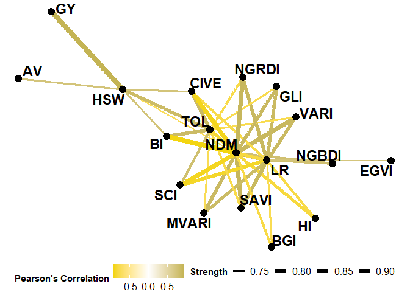

Figure 1. Network plot of significant correlations (\|r\| \> 0.7; p \<
0.05) between agronomic traits and vegetation indices. Edge width
indicates strength and color indicates correlation direction.

``` r
blue_data <- get_model_data(x = met_mu26, what = "bluege")
blue_data <- get_model_data(x = met_mu26, what = "bluege") %>%
  select(ENV, GEN, TOL, HSW, GY, BI_Mean, NGRDI_Mean, BGI_Mean, GLI_Mean,
         SI_Mean, CI_Mean, CIVE_Mean, EGVI_Mean, MVARI_Mean, NGBDI_Mean,
         SAVI_Mean, TGI_Mean)
index_traits <- c("BI_Mean", "CIVE_Mean", "NGRDI_Mean", "BGI_Mean",
                  "GLI_Mean", "SI_Mean", "CI_Mean", "EGVI_Mean",
                  "MVARI_Mean", "NGBDI_Mean", "SAVI_Mean", "TGI_Mean")

corr_env <- blue_data %>%
  group_by(ENV) %>%
  summarise(across(all_of(index_traits), ~ cor(.x, TOL, method = "pearson"))) %>%
  pivot_longer(-ENV, names_to = "Index", values_to = "cor_TOL")
corr_summary <- corr_env %>%
  group_by(Index) %>%
  summarise(mean_cor = mean(cor_TOL), sd_cor = sd(cor_TOL)) %>%
  arrange(desc(abs(mean_cor)))
corr_summary
```

    # A tibble: 12 × 3
       Index      mean_cor sd_cor
       <chr>         <dbl>  <dbl>
     1 BI_Mean       0.652  0.371
     2 CIVE_Mean     0.641  0.393
     3 NGRDI_Mean   -0.605  0.238
     4 SAVI_Mean    -0.604  0.240
     5 GLI_Mean     -0.569  0.287
     6 MVARI_Mean   -0.555  0.299
     7 NGBDI_Mean   -0.438  0.470
     8 BGI_Mean      0.426  0.483
     9 EGVI_Mean    -0.297  0.372
    10 SI_Mean      -0.183  0.446
    11 TGI_Mean     -0.176  0.354
    12 CI_Mean      NA     NA    

#### **Most Correlated Vegetation Indexes**

``` r
corr_env %>%
  group_by(ENV) %>%
  mutate(abs_cor = abs(cor_TOL)) %>%
  arrange(ENV, desc(abs_cor))
```

    # A tibble: 36 × 4
    # Groups:   ENV [3]
       ENV   Index      cor_TOL abs_cor
       <fct> <chr>        <dbl>   <dbl>
     1 AC    BI_Mean      0.794   0.794
     2 AC    CIVE_Mean    0.789   0.789
     3 AC    NGRDI_Mean  -0.765   0.765
     4 AC    SAVI_Mean   -0.765   0.765
     5 AC    GLI_Mean    -0.746   0.746
     6 AC    MVARI_Mean  -0.732   0.732
     7 AC    NGBDI_Mean  -0.691   0.691
     8 AC    BGI_Mean     0.690   0.690
     9 AC    EGVI_Mean   -0.601   0.601
    10 AC    TGI_Mean    -0.505   0.505
    # ℹ 26 more rows

``` r
best_index <- corr_env %>%
  group_by(Index) %>%
  summarise(mean_abs_cor = mean(abs(cor_TOL), na.rm = TRUE)) %>%
  arrange(desc(mean_abs_cor))
best_index
```

    # A tibble: 12 × 2
       Index      mean_abs_cor
       <chr>             <dbl>
     1 BI_Mean           0.652
     2 CIVE_Mean         0.641
     3 NGRDI_Mean        0.605
     4 SAVI_Mean         0.604
     5 GLI_Mean          0.569
     6 MVARI_Mean        0.555
     7 BGI_Mean          0.513
     8 NGBDI_Mean        0.508
     9 CI_Mean           0.400
    10 SI_Mean           0.392
    11 EGVI_Mean         0.375
    12 TGI_Mean          0.308

``` r
top_indices <- best_index$Index[1:3]
corr_env <- corr_env %>%
  mutate(Top = ifelse(Index %in% top_indices, "Top", "Other"))
```

``` r
indexbarplot <- ggplot(corr_env, aes(x = Index, y = abs(cor_TOL), fill = ENV)) +
  geom_col(aes(
    color = Top,       # contorno diferenciado
    size = Top         # tamanho do contorno
  ),
  position = position_dodge(width = 0.7)
  ) +
  # Cores de preenchimento por ambiente
  scale_fill_manual(values = c("Jab" = "#F2D400", "ANC" = "#90EE90", "AC" = "#FFA500")) +
  # Contorno: Top = preto grosso, Other = preto fino
  scale_color_manual(values = c("Top" = "black", "Other" = "black")) +
  scale_size_manual(values = c("Top" = 1.5, "Other" = 0.5)) +
  labs(
    x = "Vegetation Index",
    y = "Correlation with TOL",
    fill = "Environment",
    color = "Top Index",
    size = "Top Index"
  ) +
  theme_minimal(base_size = 14) +
  theme(
    panel.grid = element_blank(),
    axis.text = element_text(face = "bold", color = "black", size = 16),
    axis.title = element_text(face = "bold", size = 16),
    strip.text = element_text(face = "bold", size = 16),  # títulos das facetas
    legend.title = element_text(face = "bold", size = 16),
    legend.text = element_text(size = 16),
    axis.text.x = element_text(angle = 0, hjust = 1.2, face = "bold")
  )

indexbarplot
```


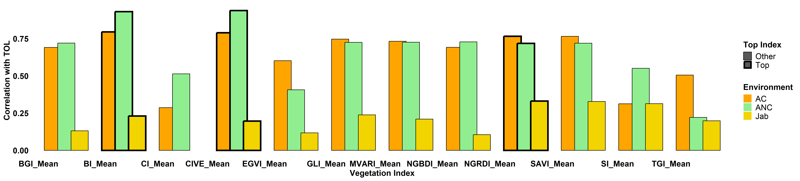

Figure 2. Barplot indicating an absolute Pearson correlation between
vegetation indices and soybean TOL across environments, highlighting the
top three indices.

### **Principal Component Analysis (PCA) of the Three Best Vegetation Indices and TOL**

``` r
blueg <- get_model_data(x = met_mu26, what = "blueg")
pca_data <- blueg %>% group_by(GEN) %>% summarise(across(c(TOL, BI_Mean, CIVE_Mean, NGRDI_Mean), mean, na.rm = TRUE)) %>% ungroup() 
pca_res <- prcomp(pca_data %>% select(-GEN), scale. = TRUE)
```

``` r
var_coords <- as.data.frame(pca_res$rotation[, 1:2])
var_coords$var <- rownames(var_coords)
arrow_scale <- 3

eig_vals <- (pca_res$sdev)^2
eig_perc <- round(100 * eig_vals / sum(eig_vals), 1)
x_lab <- paste0("PC1 (", eig_perc[1], "%)")
y_lab <- paste0("PC2 (", eig_perc[2], "%)")
pca_scores <- as.data.frame(pca_res$x)
pca_scores$GEN <- pca_data$GEN
var_coords$var <- gsub("_Mean", "", var_coords$var)

pca <- ggplot() +
  geom_hline(yintercept = 0, linetype = "dashed", color = "grey50") +
  geom_vline(xintercept = 0, linetype = "dashed", color = "grey50") +
  
  geom_point(data = pca_scores, aes(x = PC1, y = PC2),
             color = "#FFD700", size = 5) +
  
  geom_text_repel(data = pca_scores,
                  aes(x = PC1, y = PC2, label = GEN),
                  size = 6, fontface = "bold", color = "black") +
  
  geom_segment(data = var_coords,
               aes(x = 0, y = 0, xend = PC1 * arrow_scale, yend = PC2 * arrow_scale),
               arrow = arrow(length = unit(0.35, "cm")),
               color = "#5E5317", size = 1.2) +
  
  geom_text_repel(data = var_coords,
                  aes(x = PC1 * arrow_scale, y = PC2 * arrow_scale, label = var),
                  size = 6, fontface = "bold", color = "#5E5317") +
    geom_path(data = data.frame(x = cos(seq(0, 2*pi, length.out = 100)),
                              y = sin(seq(0, 2*pi, length.out = 100))),
            aes(x = x, y = y),
            color = "grey77", alpha = 0.5, size = 1) +
    theme_linedraw(base_size = 24) +
  theme(panel.grid = element_blank(),
        axis.text = element_text(face = "bold", color = "black", size = 24),
        axis.title = element_text(face = "bold", size = 26),
        plot.title = element_blank()) +
  
  labs(x = x_lab, y = y_lab)
pca
```


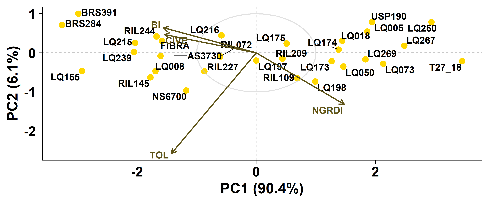

Figure 3. PCA biplot of soybean genotypes, TOL and the three top
Vegetation Index.

### **Regression Analysis**

``` r
indices <- c("NGRDI_Mean", "BI_Mean", "CIVE_Mean")
df_long <- blue_data %>%
  select(ENV, TOL, all_of(indices)) %>%
  pivot_longer(cols = all_of(indices),
               names_to = "Index",
               values_to = "Value")
h2_df <- get_model_data(met_mu26, "h2") %>%
  filter(VAR %in% indices) %>%
  rename(Index = VAR)
facet_labels <- paste0(gsub("_Mean", "", h2_df$Index), "\n(h² = ", round(h2_df$h2, 2), ")")
names(facet_labels) <- h2_df$Index
env_colors <- c("Jab" = "#F2D400", "ANC" = "#90EE90", "AC" = "#FFA500")

regression = ggplot(df_long, aes(x = Value, y = TOL)) +
  geom_point(aes(color = ENV), size = 4) +
  geom_smooth(method = "lm", se = TRUE, color = "black", linetype = "dashed") +
  stat_poly_eq(aes(label = paste(..eq.label.., ..rr.label.., sep = "~~~")),
               formula = y ~ x, parse = TRUE, size = 5) +
  facet_wrap(~ Index, scales = "free_x",
             labeller = labeller(Index = facet_labels)) +
  theme_bw(base_size = 16) +
  theme(
    panel.grid = element_blank(),
    axis.text = element_text(face = "bold", color = "black", size = 16),
    axis.title = element_text(face = "bold", size = 16),
    strip.text = element_text(face = "bold", size = 16),
    legend.title = element_text(face = "bold", size = 16),
    legend.text = element_text(size = 16)
  ) +
  labs(x = "Vegetation Index value", y = "TOL", color = "Environment") +
  scale_color_manual(values = env_colors)
regression
```


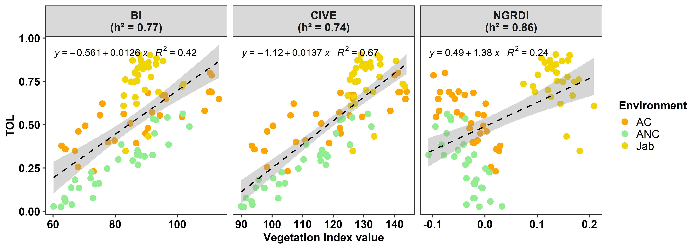

Figure 4. Relationship between soybean tolerance (TOL) and top
Vegetation Index (BI, CIVE, NGRDI) across three environments. Solid
points represent genotypes; colors indicate environments; dashed lines
show linear regression trends with R² and equation per index.

**Save the plots**

``` r
ggsave("network_plot_filtered.pdf", network_plot_filtered,
       width = 16, height = 14, dpi = 300)
ggsave("network_plot_filtered.png", network_plot_filtered,
       width = 10, height = 12, dpi = 300)
ggsave("indexbarplot.pdf", indexbarplot,
       width = 16, height = 14, dpi = 300)
ggsave("indexbarplot.png", indexbarplot,
       width = 14, height = 6, dpi = 300)
ggsave("pca.pdf", pca,
       width = 16, height = 14, dpi = 300)
ggsave("pca.png", pca,
       width = 18, height = 10, dpi = 300)
ggsave("regression.pdf", regression,
       width = 16, height = 14, dpi = 300)
ggsave("regression.png", regression,
      width = 12, height = 6, dpi = 300)
```

# Conclusions

- Vegetation indices (BI, CIVE, NGRDI) are high correlated with soybean
  tolerance (TOL) across environments, making them reliable proxies for
  indirect selection.

- UAV-based high-throughput phenotyping allows rapid evaluation of
  genotypic differences, capturing meaningful variation in TOL even at
  early growth stages.

# Future Works

Replicate trials in the 2025/2026 season using both RGB and
multispectral imagery captured by Unmanned Aerial Vehicles to improve
prediction accuracy and discrimination among tolerance classes.

# References

``` r
# Guedes, J. V. C., Arnemann, J. A., Stürmer, G. R., Melo, A. A., Bigolin, M., Perini, C. R., & Sari, B. G. (2012). Percevejos da soja: novos cenários, novo manejo. Revista Plantio Direto, 127, 24-30.
citation("metan")
```

    Please, support this project by citing it in your publications!

      Olivoto T, Lúcio AD (2020). "metan: An R package for
      multi‐environment trial analysis." _Methods in Ecology and
      Evolution_, *11*(6), 783-789. doi:10.1111/2041-210X.13384
      <https://doi.org/10.1111/2041-210X.13384>.

    Uma entrada BibTeX para usuários(as) de LaTeX é

      @Article{,
        title = {metan: An R package for multi‐environment trial analysis},
        author = {Tiago Olivoto and Alessandro Dal’Col Lúcio},
        year = {2020},
        journal = {Methods in Ecology and Evolution},
        volume = {11},
        number = {6},
        pages = {783-789},
        doi = {10.1111/2041-210X.13384},
      }

``` r
citation("FIELDimageR")
```

    The following are references to the package FIELDimageR.  You should
    also reference the individual methods used, as detailed in the
    reference section of the help files for each function.

      Matias FI, Caraza-Harter MV, Endelman JB (2020). "FIELDimageR: An R
      package to analyze orthomosaic images from agricultural field
      trials." _The Plant Phenome J._, 1-6.
      <https://doi.org/10.1002/ppj2.20005>.

      Matias FI, Caraza-Harter MV, Endelman JB (2020). _FIELDimageR: An R
      package to analyze orthomosaic images from agricultural field
      trials_. R package version 0.6.2,
      <https://doi.org/10.1002/ppj2.20005>.

    To get Bibtex entries use: x<-citation("FIELDimageR"); toBibtex(x)

    To see these entries in BibTeX format, use 'print(<citation>,
    bibtex=TRUE)', 'toBibtex(.)', or set
    'options(citation.bibtex.max=999)'.

# Aknowledgment

[University of Missouri](https://cafnr.missouri.edu/)

[FISHER DELTA CENTER SOYBEAN BREEDING
PROGRAM](https://sites.google.com/view/soymizzoufdreec/home)

[Department of Genetics](http://www.genetica.esalq.usp.br/en/) - [Luiz
de Queiroz College of Agriculture](https://en.esalq.usp.br/) (ESALQ/USP)

[Laboratory of Genetic Diversity and
Breeding](https://www.linkedin.com/in/laborat%C3%B3rio-de-diversidade-gen%C3%A9tica-e-melhoramento-9a84633b3/)

[Coordination for the Improvement of Higher Education Personnel
(CAPES)](https://www.gov.br/capes/pt-br)

<u>**Contact me**</u>

[joaosilvapavan@usp.br](joaosilvapavan@usp.br)

[js56k@missouri.edu](js56k@missouri.edu)

[LinkedIn](https://www.linkedin.com/in/joaopaulosilvapavan/)

Poster Presented:

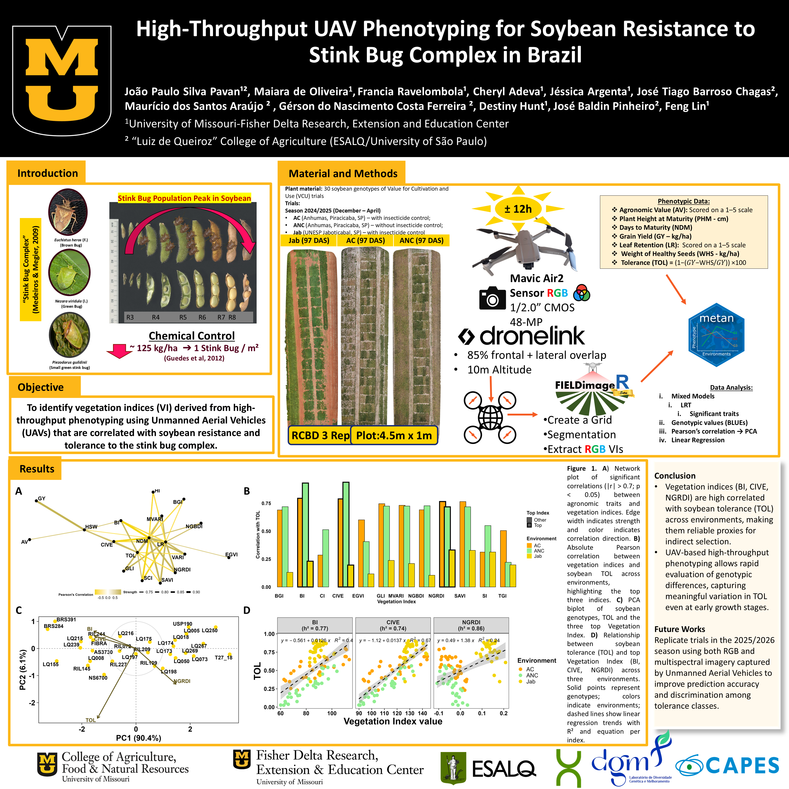
